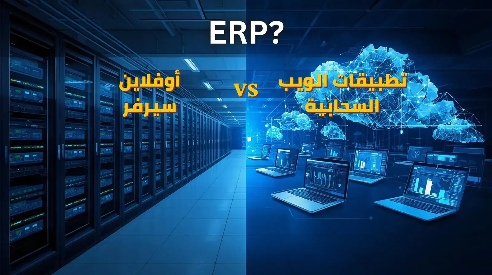

# إدارة الأعمال السحابية أم الخادم المحلي؟ مقارنة شاملة لاختيار النظام الأنسب

مع التطور المتسارع في عالم التقنية، أصبحت أنظمة إدارة الأعمال جزءًا أساسيًا من نجاح الشركات والمؤسسات بمختلف أحجامها. فسواء كنت تدير عيادة طبية، أو شركة تجارية، أو مؤسسة خدمية، فإن وجود نظام متكامل لإدارة العمليات والبيانات يساعد على تحسين الأداء، وتقليل الأخطاء، واتخاذ قرارات أكثر دقة.

لكن عند البحث عن نظام إدارة أعمال جديد، يواجه أصحاب الشركات سؤالًا مهمًا: هل الأفضل استخدام نظام يعتمد على قواعد بيانات سحابية عبر الإنترنت، أم نظام يعمل على خادم محلي داخل المؤسسة؟

لا توجد إجابة واحدة تناسب الجميع، لأن القرار يعتمد على طبيعة النشاط، وعدد المستخدمين، والميزانية، ومتطلبات الأمان، وخطط التوسع المستقبلية. في هذه المقالة سنستعرض الفروق الأساسية بين النظامين، مع توضيح المزايا والعيوب لكل خيار، لمساعدتك على اتخاذ القرار المناسب.

## ما المقصود بأنظمة إدارة الأعمال؟

أنظمة إدارة الأعمال هي برامج متخصصة تساعد المؤسسات على إدارة عملياتها اليومية من خلال قاعدة بيانات مركزية. يمكن لهذه الأنظمة إدارة العملاء، والمبيعات، والمشتريات، والمخزون، والحسابات، والموارد البشرية، والمواعيد، والتقارير وغيرها من العمليات المهمة.

يعتمد نجاح هذه الأنظمة بشكل كبير على طريقة حفظ البيانات والوصول إليها، وهنا يظهر الفرق بين الأنظمة السحابية والأنظمة المعتمدة على خادم محلي.

## أولًا: ما هي الأنظمة السحابية؟

الأنظمة السحابية هي تطبيقات تعمل عبر الإنترنت، حيث يتم حفظ البيانات على خوادم متخصصة خارج مقر الشركة، ويتم الوصول إليها من خلال المتصفح أو التطبيق باستخدام اسم مستخدم وكلمة مرور.

ومن الأمثلة على ذلك نظام العيادات الطبية الذي طورته شركة فكرة للحلول التجارية، ويمكن الاطلاع عليه من خلال الرابط التالي:

<a href="https://clinic-erp-frontend.vercel.app/login" target="_blank">نظام إدارة العيادات الطبية</a>

في هذا النوع من الأنظمة لا يحتاج المستخدم إلى شراء خادم محلي أو تجهيز بنية تقنية معقدة، بل يمكنه البدء في العمل مباشرة عبر الإنترنت.

## مزايا الأنظمة السحابية

### 1. الوصول من أي مكان

تتيح الأنظمة السحابية الوصول إلى البيانات من المكتب أو المنزل أو أثناء السفر، طالما يتوفر اتصال بالإنترنت.

هذه الميزة مهمة جدًا للمديرين وأصحاب الأعمال الذين يحتاجون إلى متابعة مؤشرات الأداء واتخاذ القرارات بسرعة دون التواجد داخل المؤسسة.

### 2. سهولة التوسع

عندما تنمو الشركة ويزداد عدد المستخدمين أو الفروع، يمكن توسيع النظام بسهولة دون الحاجة إلى شراء أجهزة جديدة أو إعادة بناء البنية التحتية.

### 3. تقليل التكاليف الأولية

بدلًا من شراء خادم وأجهزة حماية وشبكات متقدمة، يمكن الاشتراك في النظام السحابي والبدء فورًا بتكاليف أقل.

وهذا يجعل الحل السحابي مناسبًا للشركات الصغيرة والمتوسطة والأنشطة الناشئة.

### 4. التحديثات التلقائية

تتم إضافة التحسينات والتحديثات الأمنية بشكل مستمر دون الحاجة إلى تدخل المستخدم أو الاستعانة بفريق تقني داخلي.

### 5. النسخ الاحتياطي المستمر

تعتمد معظم الأنظمة السحابية على آليات متقدمة للنسخ الاحتياطي واستعادة البيانات، مما يقلل من مخاطر فقدان المعلومات بسبب الأعطال أو الأخطاء البشرية.

## عيوب الأنظمة السحابية

### 1. الاعتماد على الإنترنت

إذا انقطع الاتصال بالإنترنت أو أصبح بطيئًا بشكل كبير، فقد يتأثر الوصول إلى النظام.

ورغم أن جودة الإنترنت أصبحت أفضل في معظم المناطق، إلا أن بعض المؤسسات ما زالت تعتبر هذا العامل مصدر قلق.

### 2. الاشتراكات المستمرة

غالبًا ما تعتمد الأنظمة السحابية على رسوم شهرية أو سنوية، وهو ما قد يجعل التكلفة الإجمالية أعلى على المدى الطويل في بعض الحالات.

### 3. مخاوف تتعلق بالخصوصية

بعض المؤسسات تفضل الاحتفاظ بجميع البيانات داخل مقرها لأسباب تنظيمية أو قانونية أو تشغيلية، ولذلك قد تتردد في استخدام الحلول السحابية.

## ثانيًا: ما هي الأنظمة المعتمدة على الخادم المحلي؟

في هذا النموذج يتم تثبيت البرنامج وقاعدة البيانات على خادم موجود داخل المؤسسة نفسها. ويتم الوصول إلى البيانات من خلال الشبكة الداخلية الخاصة بالشركة.

كانت هذه الطريقة هي الأكثر انتشارًا لسنوات طويلة، وما زالت تستخدم في العديد من المؤسسات الحكومية والصناعية وبعض الشركات الكبيرة.

## مزايا الأنظمة المعتمدة على الخادم المحلي

### 1. التحكم الكامل في البيانات

تبقى جميع البيانات داخل المؤسسة وتحت سيطرتها المباشرة، وهو ما يمنح بعض الإدارات شعورًا أكبر بالتحكم والخصوصية.

### 2. العمل دون إنترنت

يمكن للموظفين الاستمرار في استخدام النظام حتى في حالة انقطاع الإنترنت، طالما أن الشبكة الداخلية تعمل بشكل طبيعي.

### 3. تقليل الاشتراكات الدورية

بعد شراء النظام وتجهيز الخادم قد لا تكون هناك رسوم تشغيل شهرية كبيرة مقارنة ببعض الأنظمة السحابية.

### 4. تخصيص أكبر في بعض الحالات

يمكن إجراء تعديلات متقدمة على الخادم أو بيئة العمل بما يتناسب مع احتياجات المؤسسة الخاصة.

## عيوب الأنظمة المعتمدة على الخادم المحلي

### 1. ارتفاع التكلفة الأولية

يتطلب هذا النموذج شراء خادم وأجهزة حماية وشبكات وتجهيزات إضافية، إضافة إلى تكاليف التركيب والصيانة.

### 2. الحاجة إلى دعم تقني مستمر

تحتاج المؤسسة غالبًا إلى فريق تقني أو جهة متخصصة لمتابعة الخادم، وحل الأعطال، وإجراء النسخ الاحتياطي، وتطبيق التحديثات الأمنية.

### 3. صعوبة التوسع

عند زيادة عدد المستخدمين أو الفروع قد تحتاج المؤسسة إلى ترقية الأجهزة أو شراء خوادم إضافية.

### 4. مخاطر الأعطال المحلية

في حال تعرض الخادم المحلي للتلف أو السرقة أو الحريق أو الكوارث الطبيعية، قد تكون عملية استعادة البيانات أكثر تعقيدًا إذا لم تكن هناك خطة نسخ احتياطي فعالة.

## مقارنة مباشرة بين الحلين

| العنصر                   | النظام السحابي | الخادم المحلي     |
| ------------------------ | -------------- | ----------------- |
| الوصول من أي مكان        | ممتاز          | محدود             |
| العمل دون إنترنت         | محدود          | ممتاز             |
| التكلفة الأولية          | منخفضة         | مرتفعة            |
| التوسع المستقبلي         | سهل            | أكثر تعقيدًا      |
| التحديثات                | تلقائية        | يدوية غالبًا      |
| النسخ الاحتياطي          | متقدم          | يعتمد على المؤسسة |
| إدارة البنية التقنية     | بسيطة          | تحتاج إلى خبرة    |
| التحكم المباشر بالبيانات | متوسط          | مرتفع             |

## ماذا عن الأمان؟

يعتقد البعض أن الخادم المحلي أكثر أمانًا دائمًا، لكن الواقع أكثر تعقيدًا من ذلك.

تعتمد درجة الأمان على جودة التنفيذ والإدارة أكثر من نوع النظام نفسه.

فالأنظمة السحابية الحديثة تستخدم تقنيات تشفير متقدمة، ومراكز بيانات احترافية، وأنظمة مراقبة تعمل على مدار الساعة.

وفي المقابل، قد تكون بعض الخوادم المحلية عرضة للمخاطر إذا لم يتم تحديثها أو حمايتها بشكل صحيح.

يمكن الاطلاع على مفهوم الحوسبة السحابية بشكل أوسع من خلال موسوعة ويكيبيديا:

<a href="https://ar.wikipedia.org/wiki/%D8%A7%D9%84%D8%AD%D9%88%D8%B3%D8%A8%D8%A9_%D8%A7%D9%84%D8%B3%D8%AD%D8%A7%D8%A8%D9%8A%D8%A9" target="_blank" rel="noopener">الحوسبة السحابية</a>

## أيهما أفضل للعيادات الطبية؟

في السنوات الأخيرة اتجهت نسبة كبيرة من العيادات والمراكز الطبية إلى الحلول السحابية بسبب سهولة الوصول إلى ملفات المرضى، وإدارة المواعيد، ومتابعة الإيرادات، وإصدار التقارير من أي مكان.

كما أن وجود فروع متعددة للمنشأة الطبية يجعل الأنظمة السحابية أكثر كفاءة في توحيد البيانات وتسهيل الإدارة المركزية.

## متى يكون الخادم المحلي هو الخيار الأفضل؟

قد يكون الخادم المحلي مناسبًا عندما:

* توجد متطلبات تنظيمية صارمة تمنع تخزين البيانات خارج المؤسسة.
* يتوفر فريق تقني قادر على إدارة البنية التحتية.
* تكون الحاجة إلى العمل المستمر دون اتصال بالإنترنت أمرًا بالغ الأهمية.
* تمتلك المؤسسة بالفعل بنية تقنية قوية يمكن الاستفادة منها.

## متى تكون الأنظمة السحابية الخيار الأفضل؟

تعتبر الأنظمة السحابية مناسبة عندما:

* ترغب المؤسسة في تقليل التكاليف الأولية.
* تحتاج إلى الوصول إلى البيانات من مواقع متعددة.
* يوجد أكثر من فرع أو أكثر من موقع عمل.
* ترغب الإدارة في الحصول على تحديثات مستمرة دون تدخل تقني.
* تخطط المؤسسة للنمو والتوسع خلال السنوات القادمة.

## الخلاصة

عند المقارنة بين الأنظمة السحابية والأنظمة المعتمدة على الخادم المحلي، نجد أن لكل منهما نقاط قوة ونقاط ضعف. ومع ذلك، تتجه غالبية الشركات الحديثة إلى الحلول السحابية لما توفره من مرونة عالية، وسهولة في الإدارة، وإمكانية الوصول من أي مكان، وتكاليف تشغيل أكثر قابلية للتنبؤ.

أما المؤسسات التي تحتاج إلى سيطرة كاملة على البنية التحتية أو تعمل في بيئات ذات متطلبات خاصة جدًا، فقد تجد أن الخادم المحلي ما زال الخيار الأنسب لها.

الأهم من اختيار نوع التقنية هو اختيار نظام موثوق يلبي احتياجات العمل الحالية والمستقبلية. وإذا كنت ترغب في متابعة المزيد من المقالات والنصائح المتعلقة بالتحول الرقمي وإدارة الأعمال، يمكنك زيارة مدونتنا:

<a href="https://fekrasolutions.github.io/Remote-Virtual-Assistance/ar/blog.html" target="_blank">مدونة فكرة للحلول التجارية</a>

وفي النهاية، فإن الاستثمار في نظام إدارة أعمال مناسب ليس مجرد قرار تقني، بل هو قرار استراتيجي يؤثر بشكل مباشر على كفاءة التشغيل، وجودة الخدمة، وقدرة المؤسسة على النمو والمنافسة في المستقبل.
