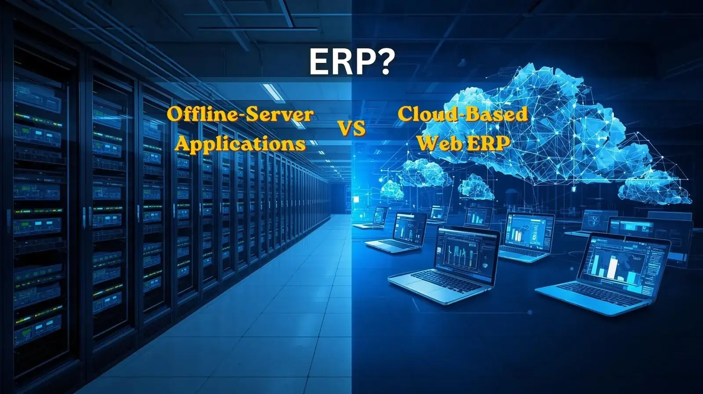

# Cloud ERP vs On-Premise ERP: Which Is Right for Your Business?

Choosing the right Enterprise Resource Planning (ERP) system is one of the most important technology decisions a business can make. Whether you run a healthcare practice, a retail operation, a manufacturing company, or a professional services firm, your ERP system serves as the foundation for managing operations, data, finances, customers, and reporting.

Today, businesses generally have two primary options when selecting an ERP solution: a cloud-based ERP system or an on-premise ERP system hosted on a local server.

While both approaches can effectively manage business processes, they differ significantly in terms of cost, accessibility, maintenance, security, scalability, and long-term value. Understanding these differences is essential before making an investment that may impact your organization for years to come.

In this article, we'll compare Cloud ERP and On-Premise ERP solutions, explore their advantages and disadvantages, and help you determine which option best aligns with your business goals.

## What Is an ERP System?

An ERP system is a software platform that integrates multiple business functions into a centralized database and management environment. Rather than using separate tools for accounting, inventory, customer management, scheduling, purchasing, and reporting, an ERP system connects everything in one place.

This centralized approach improves efficiency, reduces manual work, minimizes errors, and provides decision-makers with accurate real-time information.

The primary difference between modern ERP solutions lies in where the data is stored and how users access it.

## What Is Cloud ERP?

Cloud ERP is a software solution hosted on remote servers and accessed through the internet. Users can log in from any authorized device without needing direct access to company infrastructure.

Cloud ERP providers manage the servers, security updates, backups, and technical maintenance, allowing businesses to focus on operations instead of technology management.

An example of a modern cloud-based healthcare management platform is:

<a href="https://clinic-erp-frontend.vercel.app/login" target="_blank">ClinicERP</a>

Cloud ERP has become increasingly popular among businesses of all sizes because of its flexibility and lower infrastructure requirements.

## Advantages of Cloud ERP

### 1. Access from Anywhere

One of the biggest benefits of Cloud ERP is the ability to access business information from virtually any location.

Managers can review reports while traveling, employees can work remotely, and multi-branch organizations can maintain centralized operations without geographic limitations.

This flexibility has become especially valuable in today's increasingly mobile business environment.

### 2. Lower Upfront Costs

Traditional ERP implementations often require significant investments in hardware, servers, networking equipment, and IT infrastructure.

Cloud ERP eliminates most of these costs because the software runs on external servers maintained by the provider.

Businesses can typically begin using the system with a subscription model, reducing the initial financial burden.

### 3. Automatic Updates

Technology evolves rapidly, and ERP systems require ongoing improvements to remain secure and efficient.

With Cloud ERP, updates are usually performed automatically by the provider. Organizations gain access to new features, performance improvements, and security enhancements without disrupting daily operations.

### 4. Improved Scalability

As businesses grow, their software requirements also expand.

Cloud ERP solutions allow organizations to add users, locations, storage, and functionality without purchasing additional infrastructure.

This makes cloud solutions particularly attractive for growing businesses that expect future expansion.

### 5. Simplified IT Management

Because the provider manages servers, backups, maintenance, and security monitoring, businesses can reduce their reliance on internal IT resources.

This allows management teams to focus more on strategic growth rather than technical administration.

## Potential Drawbacks of Cloud ERP

### 1. Dependence on Internet Connectivity

Cloud ERP requires internet access for optimal performance.

While modern internet services are generally reliable, outages or poor connectivity can temporarily impact system accessibility.

Organizations operating in regions with unstable internet infrastructure should carefully evaluate this factor.

### 2. Ongoing Subscription Costs

Cloud ERP solutions typically use recurring monthly or annual subscription fees.

Although initial costs are lower, businesses should evaluate the total cost of ownership over several years when comparing options.

### 3. Data Location Concerns

Some organizations prefer to keep sensitive data entirely within their own facilities due to regulatory requirements, internal policies, or privacy concerns.

In such situations, cloud hosting may require additional evaluation before adoption.

## What Is On-Premise ERP?

On-Premise ERP systems are installed and operated on servers located within the organization's physical environment.

The company owns and manages the infrastructure, software deployment, security configurations, backups, and maintenance activities.

For many years, this was the standard ERP deployment model and remains common in certain industries and large enterprises.

## Advantages of On-Premise ERP

### 1. Complete Control Over Infrastructure

Organizations maintain direct control over servers, databases, networking equipment, and security configurations.

This level of control is often preferred by businesses with highly specialized operational requirements.

### 2. Local Operation Without Internet Dependency

Employees can continue accessing the ERP system through the internal network even if internet connectivity becomes unavailable.

For organizations that require uninterrupted local operations, this can be a significant advantage.

### 3. Greater Customization Flexibility

Some businesses require extensive customization that may be easier to implement within a self-managed environment.

Direct access to infrastructure can provide additional flexibility for advanced configurations.

### 4. Internal Data Management

All business data remains within company-controlled facilities, which may simplify compliance with certain internal policies and regulations.

## Potential Drawbacks of On-Premise ERP

### 1. Higher Initial Investment

On-Premise ERP solutions typically require substantial upfront spending on servers, networking equipment, storage systems, backup solutions, and deployment services.

These costs can be significant, particularly for small and medium-sized businesses.

### 2. Ongoing Maintenance Responsibilities

Unlike cloud environments, organizations are responsible for maintaining hardware, applying updates, monitoring security threats, and managing backups.

This often requires dedicated technical staff or external support providers.

### 3. More Complex Scalability

When business growth requires additional resources, organizations may need to purchase and deploy new hardware.

Scaling an on-premise environment can therefore be slower and more expensive than scaling a cloud platform.

### 4. Disaster Recovery Challenges

Hardware failures, natural disasters, theft, or other unexpected events can affect locally hosted infrastructure.

Without robust backup and recovery procedures, data loss risks may increase.

## Security: Cloud ERP vs On-Premise ERP

Security is often one of the most discussed topics when comparing ERP deployment models.

Many business owners assume that on-premise systems are automatically more secure because the data remains inside the company.

However, security depends far more on implementation, management practices, and ongoing monitoring than on physical location alone.

Leading cloud providers invest heavily in cybersecurity technologies, encryption, intrusion detection, backup systems, and continuous monitoring. These resources often exceed what many small and medium-sized organizations can maintain internally.

For a broader understanding of cloud computing technologies, visit:

<a href="https://en.wikipedia.org/wiki/Cloud_computing" target="_blank" rel="noopener">Cloud Computing - Wikipedia</a>

Ultimately, both deployment models can be highly secure when properly managed.

## Cost Comparison

When evaluating ERP solutions, businesses should look beyond initial expenses and consider long-term ownership costs.

Cloud ERP generally offers:

* Lower startup costs
* Predictable subscription fees
* Reduced infrastructure spending
* Lower maintenance expenses

On-Premise ERP generally involves:

* Higher upfront investments
* Hardware replacement costs
* Internal IT staffing requirements
* Ongoing maintenance responsibilities

For many growing organizations, Cloud ERP often delivers a lower total cost of ownership over time.

## Which ERP Model Is Best for Healthcare Organizations?

Healthcare providers increasingly favor cloud-based systems because they support centralized patient management, appointment scheduling, billing, reporting, and multi-location access.

Cloud solutions enable doctors, administrators, and management teams to access information securely from various locations while maintaining operational efficiency.

Organizations seeking modern healthcare management solutions often benefit from cloud-based platforms that reduce infrastructure complexity while improving accessibility.

## When Should You Choose On-Premise ERP?

An On-Premise ERP solution may be the right choice if:

* Your organization has strict internal data policies.
* You maintain a capable internal IT department.
* Continuous local operation is critical.
* You require highly specialized infrastructure configurations.
* Existing investments in server infrastructure remain valuable.

## When Should You Choose Cloud ERP?

Cloud ERP may be the better option if:

* You want lower upfront costs.
* Your workforce operates across multiple locations.
* Remote access is important.
* You prefer automatic updates and maintenance.
* Your business plans to grow and scale rapidly.
* You want to minimize infrastructure management responsibilities.

## Final Thoughts

The decision between Cloud ERP and On-Premise ERP is not simply a technology choice—it is a strategic business decision.

Cloud ERP offers flexibility, scalability, accessibility, and simplified management, making it an attractive option for many modern organizations. On-Premise ERP provides direct control, local operation, and infrastructure ownership that may suit businesses with specialized requirements.

The best solution depends on your organization's goals, resources, compliance requirements, and growth plans.

Before making a decision, carefully evaluate your operational needs, budget, technical capabilities, and long-term strategy. An ERP system should not only support today's operations but also help your business adapt and grow in the future.

For more insights on digital transformation, business management systems, and operational efficiency, visit our blog:

<a href="https://fekrasolutions.github.io/Remote-Virtual-Assistance/en/blog.html" target="_blank">Fekra Business Solutions Blog</a>

Investing in the right ERP platform today can significantly improve productivity, enhance decision-making, and create a stronger foundation for long-term success.
