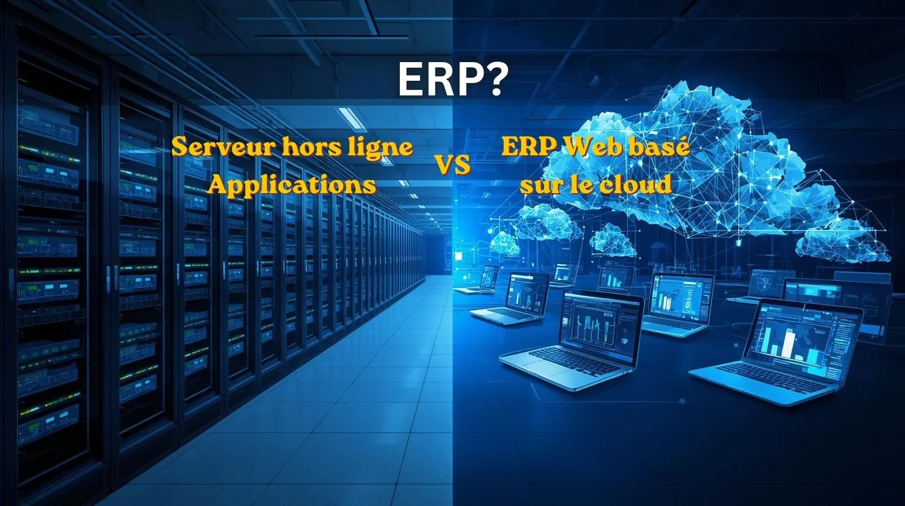

# ERP Cloud ou ERP sur Site : Quelle Solution Choisir pour Votre Entreprise ?

La transformation numérique est devenue un facteur clé de compétitivité pour les entreprises modernes. Qu'il s'agisse d'un cabinet médical, d'une société commerciale, d'une entreprise industrielle ou d'une organisation de services, la gestion efficace des données et des processus est aujourd'hui indispensable.

Au cœur de cette transformation se trouvent les systèmes ERP (Enterprise Resource Planning), ou progiciels de gestion intégrés. Ces solutions permettent de centraliser les opérations de l'entreprise dans un environnement unique afin d'améliorer la productivité, réduire les erreurs et faciliter la prise de décision.

Cependant, une question revient souvent lors du choix d'un ERP : faut-il opter pour un ERP Cloud hébergé sur Internet ou pour un ERP sur site installé sur un serveur local ?

Les deux approches présentent des avantages et des inconvénients. Le choix dépend de nombreux facteurs tels que la taille de l'entreprise, le budget, les exigences de sécurité, les ressources informatiques disponibles et les objectifs de croissance.

Dans cet article, nous allons comparer en détail les ERP Cloud et les ERP sur site afin de vous aider à prendre la meilleure décision pour votre activité.

## Qu'est-ce qu'un ERP ?

Un ERP est un logiciel qui regroupe plusieurs fonctions de gestion au sein d'une seule plateforme. Il permet notamment de gérer :

* La comptabilité
* Les ventes
* Les achats
* Les stocks
* Les ressources humaines
* Les rendez-vous
* Les clients
* Les rapports et tableaux de bord

Grâce à une base de données centralisée, tous les services de l'entreprise travaillent avec les mêmes informations, ce qui améliore la cohérence et l'efficacité des opérations.

La principale différence entre les solutions ERP modernes réside dans l'emplacement des données et la manière dont les utilisateurs y accèdent.

## Qu'est-ce qu'un ERP Cloud ?

Un ERP Cloud est hébergé sur des serveurs distants accessibles via Internet. Les utilisateurs se connectent au système à l'aide d'un navigateur web ou d'une application sécurisée.

L'infrastructure, les sauvegardes, les mises à jour et la maintenance sont généralement assurées par le fournisseur de la solution.

Par exemple, les établissements médicaux peuvent utiliser une solution moderne comme :

<a href="https://clinic-erp-frontend.vercel.app/login" target="_blank">ClinicERP</a>

Ce modèle est devenu particulièrement populaire grâce à sa flexibilité et à sa simplicité de déploiement.

## Les avantages de l'ERP Cloud

### 1. Accès depuis n'importe où

L'un des principaux atouts du Cloud est la possibilité d'accéder aux données depuis n'importe quel lieu disposant d'une connexion Internet.

Les dirigeants peuvent consulter leurs indicateurs en déplacement, tandis que les collaborateurs peuvent travailler à distance sans difficulté.

Cette flexibilité est devenue essentielle dans un environnement professionnel de plus en plus mobile.

### 2. Réduction des investissements initiaux

L'ERP Cloud ne nécessite généralement pas l'achat de serveurs coûteux ni d'infrastructures complexes.

Les entreprises peuvent démarrer rapidement avec un abonnement mensuel ou annuel, ce qui réduit considérablement les dépenses initiales.

### 3. Mises à jour automatiques

Les mises à jour logicielles sont réalisées par le fournisseur sans intervention des utilisateurs.

Les entreprises bénéficient ainsi en permanence des dernières fonctionnalités, améliorations et correctifs de sécurité.

### 4. Évolutivité simplifiée

Lorsque l'entreprise grandit, il devient facile d'ajouter des utilisateurs, des espaces de stockage ou de nouvelles fonctionnalités.

Cette capacité d'évolution constitue un avantage majeur pour les organisations en croissance.

### 5. Maintenance réduite

Les équipes internes n'ont plus à gérer les serveurs, les sauvegardes ou les opérations de maintenance complexes.

Cela permet de concentrer les ressources sur le développement de l'activité plutôt que sur la gestion technique.

## Les limites de l'ERP Cloud

### 1. Dépendance à Internet

L'accès au système nécessite une connexion Internet stable.

Bien que ce problème soit aujourd'hui moins important qu'autrefois, certaines entreprises peuvent considérer cette dépendance comme un risque.

### 2. Coûts récurrents

Le modèle Cloud repose généralement sur des abonnements réguliers.

Il est donc important d'évaluer le coût total sur plusieurs années afin de comparer efficacement les différentes options.

### 3. Préoccupations liées à la localisation des données

Certaines entreprises préfèrent conserver leurs données exclusivement au sein de leurs propres infrastructures pour des raisons réglementaires ou stratégiques.

## Qu'est-ce qu'un ERP sur Site ?

Un ERP sur site est installé directement sur les serveurs de l'entreprise.

Les données sont stockées localement et l'organisation gère elle-même l'ensemble de l'infrastructure informatique.

Pendant de nombreuses années, cette approche a représenté le modèle standard de déploiement des ERP.

Aujourd'hui encore, elle reste utilisée par certaines grandes entreprises et institutions disposant d'importantes ressources techniques.

## Les avantages de l'ERP sur Site

### 1. Contrôle total de l'infrastructure

L'entreprise conserve une maîtrise complète de ses serveurs, de ses bases de données et de ses paramètres de sécurité.

Cette autonomie peut être particulièrement appréciée dans certains secteurs sensibles.

### 2. Fonctionnement local

Même en cas de coupure Internet, les utilisateurs peuvent continuer à accéder au système via le réseau interne de l'entreprise.

Cette caractéristique peut être déterminante pour certaines organisations.

### 3. Personnalisation avancée

Certaines entreprises ont besoin d'adaptations très spécifiques.

Un environnement local peut parfois offrir davantage de possibilités de personnalisation technique.

### 4. Gestion interne des données

Les données restent physiquement dans les locaux de l'entreprise, ce qui peut répondre à certaines exigences réglementaires ou stratégiques.

## Les inconvénients de l'ERP sur Site

### 1. Investissement initial important

L'acquisition de serveurs, d'équipements réseau, de systèmes de sauvegarde et de sécurité représente un coût élevé.

Cette dépense peut constituer un frein pour les petites et moyennes entreprises.

### 2. Maintenance permanente

Les équipes internes doivent assurer :

* Les mises à jour
* Les sauvegardes
* La surveillance des serveurs
* La gestion de la sécurité

Cela nécessite souvent des compétences spécialisées.

### 3. Évolutivité plus complexe

L'ajout de nouveaux utilisateurs ou l'augmentation des capacités nécessite généralement l'achat de matériel supplémentaire.

Cette évolution peut être plus lente et plus coûteuse qu'avec une solution Cloud.

### 4. Risques liés aux infrastructures physiques

Une panne matérielle, un incendie, un vol ou une catastrophe naturelle peuvent compromettre l'accès aux données si les sauvegardes ne sont pas correctement gérées.

## Comparaison directe entre ERP Cloud et ERP sur Site

| Critère                      | ERP Cloud    | ERP sur Site  |
| ---------------------------- | ------------ | ------------- |
| Accès à distance             | Excellent    | Limité        |
| Investissement initial       | Faible       | Élevé         |
| Maintenance                  | Fournisseur  | Entreprise    |
| Évolutivité                  | Très simple  | Plus complexe |
| Sauvegardes                  | Automatisées | À gérer       |
| Mises à jour                 | Automatiques | Manuelles     |
| Mobilité                     | Très élevée  | Limitée       |
| Contrôle de l'infrastructure | Moyen        | Total         |

## La question de la sécurité

La sécurité constitue souvent un critère décisif lors du choix d'un ERP.

Contrairement à certaines idées reçues, un ERP sur site n'est pas automatiquement plus sécurisé qu'un ERP Cloud.

Les principaux fournisseurs Cloud investissent massivement dans :

* Le chiffrement des données
* Les pare-feu avancés
* La détection des intrusions
* Les sauvegardes redondantes
* La surveillance permanente

Pour mieux comprendre le fonctionnement de cette technologie, vous pouvez consulter :

<a href="https://fr.wikipedia.org/wiki/Informatique_en_nuage" target="_blank" rel="noopener">Informatique en nuage - Wikipédia</a>

La qualité de la sécurité dépend avant tout de la manière dont le système est administré.

## Quel est le coût réel ?

Lorsqu'une entreprise compare les deux modèles, elle doit considérer le coût total de possession.

L'ERP Cloud permet généralement :

* Des dépenses initiales réduites
* Des coûts prévisibles
* Moins de matériel informatique
* Moins de maintenance interne

L'ERP sur site implique souvent :

* Un investissement important au départ
* Le renouvellement périodique du matériel
* Des frais de maintenance
* Des ressources techniques dédiées

Pour de nombreuses PME, le Cloud apparaît aujourd'hui comme l'option la plus économique sur le long terme.

## Quel ERP pour les établissements médicaux ?

Les cliniques, cabinets médicaux et centres de santé adoptent de plus en plus les solutions Cloud.

Ces plateformes facilitent :

* La gestion des dossiers patients
* La planification des rendez-vous
* La facturation
* Les rapports financiers
* La gestion multi-sites

Grâce à un accès sécurisé à distance, les responsables peuvent superviser leurs activités plus efficacement.

## Quand choisir un ERP sur Site ?

L'ERP sur site peut être pertinent lorsque :

* Les exigences réglementaires sont très strictes.
* L'entreprise possède une équipe informatique expérimentée.
* Le fonctionnement hors ligne est indispensable.
* Des infrastructures locales importantes existent déjà.

## Quand choisir un ERP Cloud ?

L'ERP Cloud est souvent le meilleur choix lorsque :

* Le budget initial est limité.
* Les équipes travaillent sur plusieurs sites.
* Le télétravail est fréquent.
* L'entreprise prévoit une croissance rapide.
* La simplicité de gestion est une priorité.

## Conclusion

Le choix entre ERP Cloud et ERP sur site dépend avant tout des besoins spécifiques de votre entreprise.

Les solutions Cloud séduisent aujourd'hui un nombre croissant d'organisations grâce à leur flexibilité, leur accessibilité et leur évolutivité. Elles permettent de démarrer rapidement tout en limitant les contraintes techniques.

Les ERP sur site restent néanmoins adaptés aux structures qui souhaitent conserver un contrôle total sur leur infrastructure ou qui doivent répondre à des exigences particulières.

Avant de prendre votre décision, analysez soigneusement vos objectifs, vos ressources, vos contraintes réglementaires et votre stratégie de croissance.

Pour découvrir davantage de conseils sur la transformation numérique, les logiciels de gestion et l'optimisation des processus, consultez notre blog :

<a href="https://fekrasolutions.github.io/Remote-Virtual-Assistance/en/blog.html" target="_blank">Blog Fekra Business Solutions</a>

Investir dans un ERP adapté aujourd'hui peut considérablement améliorer la performance de votre organisation et créer les bases d'une croissance durable pour les années à venir.
